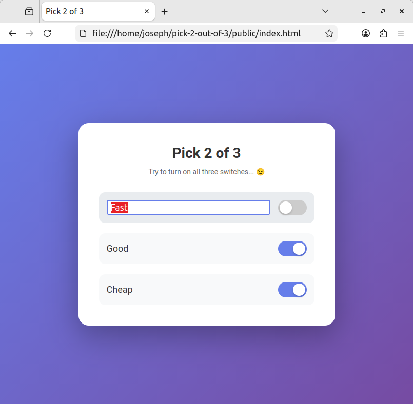

# Pick 2 of 3
This is a super simple implementation of the classic "Fast, Good, Cheap: Pick 2". It was made with copious help from Claude AI, so don't expect super high quality code.

## Screenshot

## Usage
Click on the switches to toggle them. You should notice that an option randomly gets disabled whenever you try to choose all three. You can edit the option names by clicking on them.

There are also keyboard controls. Press tab to move to the next option, and space to toggle it. You can edit the option names by pressing enter. In editing mode, tab saves and moves to edit the next option, enter saves and exits editing mode, and escape exits editing mode without saving.

Tabbing should cycle through the three options. If you want break the cycle (e.g., you're using a screen reader), press escape when on the last option to lose focus and then tab away, or press escape when on the first option to lose focus and then shift+tab away.
